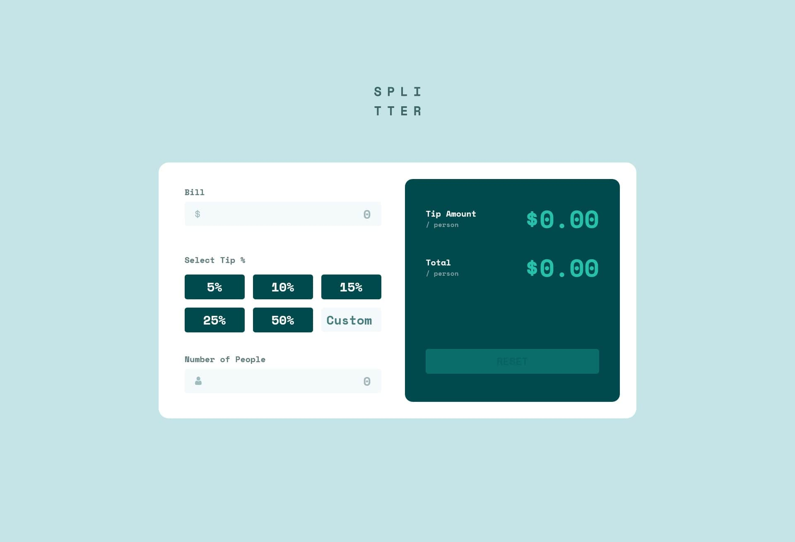

# Frontend Mentor - Tip calculator app solution

This is a solution to the [Tip calculator app challenge on Frontend Mentor](https://www.frontendmentor.io/challenges/tip-calculator-app-ugJNGbJUX). Frontend Mentor challenges help you improve your coding skills by building realistic projects.

## Table of contents

- [Overview](#overview)
  - [The challenge](#the-challenge)
  - [Screenshot](#screenshot)
  - [Links](#links)
- [My process](#my-process)
  - [Built with](#built-with)
  - [What I learned](#what-i-learned)

## Overview

### The challenge

Users should be able to:

- View the optimal layout for the app depending on their device's screen size
- See hover states for all interactive elements on the page
- Calculate the correct tip and total cost of the bill per person

### Screenshot




### Links

- Solution URL: [Tip Calculator Solution](https://github.com/telsabate-hub/tip-calculator-app)
- Live Site URL: [Tip Calculator Page](https://telsabate-hub.github.io/tip-calculator-app/)

## My process

### Built with

- Semantic HTML5 markup
- CSS custom properties
- Flexbox
- CSS Grid
- SASS/SCSS
- JavaScript

### What I learned

- I learned that I can style the placeholder of an input using the placeholder selector like this:

```css
::placeholder{
  color: $grey_200;
  opacity: 70%;
}
```
- The border color of a text input in ```:focus``` pseudo-class will only change if the following style is added:

```css
outline: none;
```
- To force a number to have two decimal places only, I used the following:

```js
tipAmount.toFixed(2);
```


